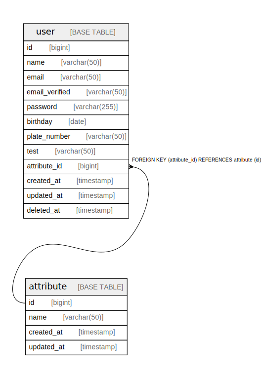

# tbls_demo_box

## Viewpoints

| Name | Description |
| ---- | ----------- |
| [User情報](viewpoint-0.html) | User情報に関するドキュメント |

## Tables

| Name | Columns | Comment | Type | Labels |
| ---- | ------- | ------- | ---- | ------ |
| [attribute](attribute.html) | 4 |  | BASE TABLE |  |
| [user](user.html) | 12 | Users table | BASE TABLE | `user` `privacy data` |

## Relations

---

> Generated by [tbls](https://github.com/k1LoW/tbls)
